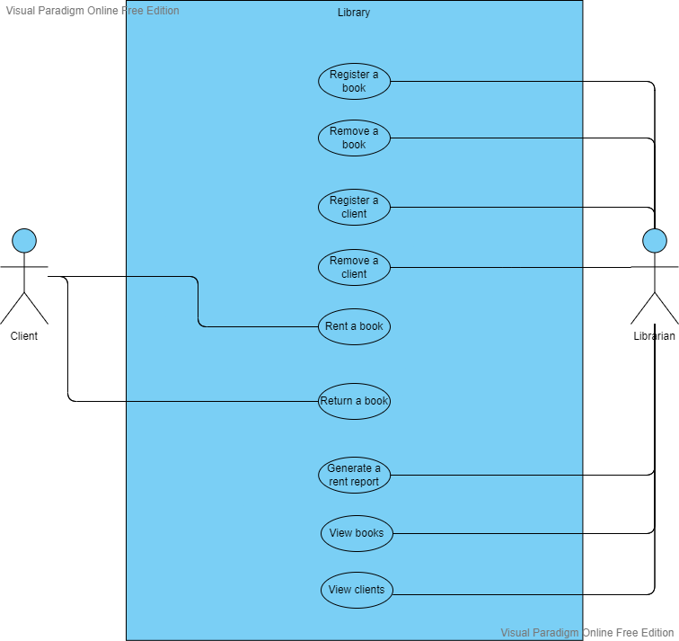

# app.Library System
System for the management of a library.

## Business Rules
- A client can only rent 2 books at a time;
- A clint can only rent a book, if it is not one of the last 3 books he rented;
- The library only has 1 copy of each book;

## Use Cases Diagram

## Class Diagram
